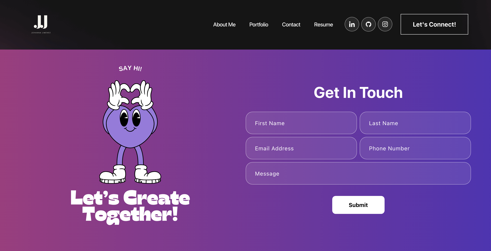
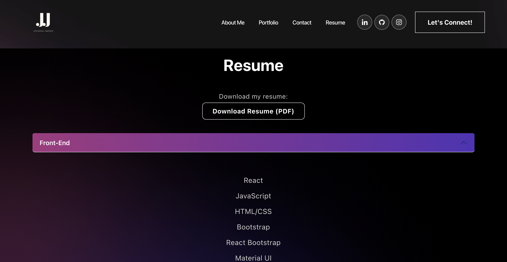
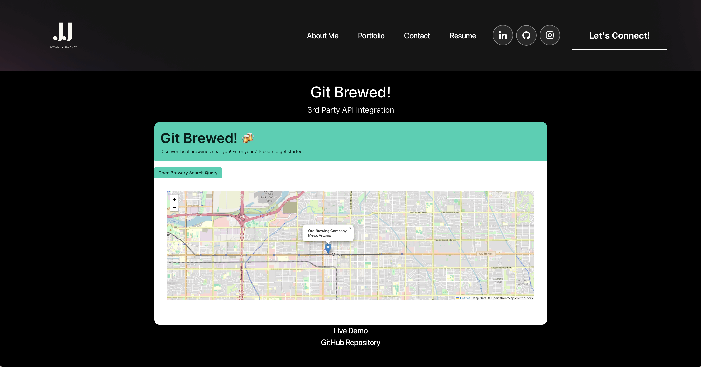

# Jovanna Jimenez's Portfolio

## Table of Contents 
- [Description](#description) 
- [Installation](#installation)
- [Usage](#usage)
- [Testing](#testing)
- [Technologies](#technologies)
- [Contribution](#contribution)
- [Examples](#examples)
- [License](#license)
- [Questions](#questions)

## Description 
    Welcome to my React Portfolio! This project showcases various applications I've developed, structured using React and deployed using Netlify.

## Installation 
To view and interact with the portfolio:

- Clone the repository.
- Install dependencies using `npm install`.

## Usage 
 - Start the development server with `npm start`.

## Testing 
    Testing information to be added when developed.

## Technologies Used 

- React
- React Router
- React Bootstrap
- Netlify 

## Contribution

- Web-dev-projects: https://github.com/judygab/web-dev-projects.git
- BootCampSpot Tutoring Services
- Mini Project: Bucket List

## Examples  

## License 
    N/A

## Questions 
    For any questions, please contact [jovanna24](https://github.com/jovanna24) at jovannajimenez1124@gmail.com.
